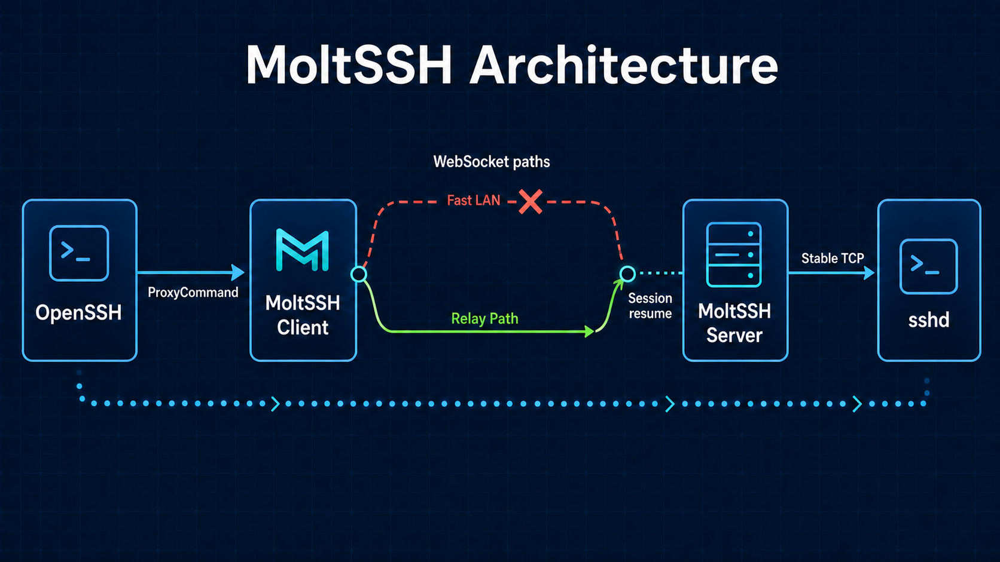

<a id="readme-top"></a>

# MoltSSH

[English](README.md) | [中文](README.zh.md)

[](https://github.com/JingYiJun/MoltSSH/actions/workflows/ci.yml)
[](https://github.com/JingYiJun/MoltSSH/releases)
[](LICENSE)

MoltSSH is a resumable OpenSSH `ProxyCommand` over WebSocket.

The current MVP uses WebSocket transport. Existing relay tools provide
reachability; MoltSSH provides session resume, path probing, and path
switching.

[View Releases](https://github.com/JingYiJun/MoltSSH/releases) ·
[Changelog](CHANGELOG.md) ·
[Report Bug](https://github.com/JingYiJun/MoltSSH/issues/new?template=bug_report.yml) ·
[Request Feature](https://github.com/JingYiJun/MoltSSH/issues/new?template=feature_request.yml)



## Table of Contents

1. [About The Project](#about-the-project)
2. [Built With](#built-with)
3. [Getting Started](#getting-started)
4. [Usage](#usage)
5. [Troubleshooting](#troubleshooting)
6. [Configuration](#configuration)
7. [Roadmap](#roadmap)
8. [Contributing](#contributing)
9. [Security](#security)
10. [License](#license)
11. [Contact](#contact)
12. [Acknowledgments](#acknowledgments)

## About The Project

MoltSSH keeps the server-side TCP connection to `sshd` stable while the client
reconnects through the healthiest configured WebSocket path. This lets an
OpenSSH session continue through client-side network churn, relay restarts, and
path changes that preserve the MoltSSH server process.

Current capabilities:

- OpenSSH `ProxyCommand` compatibility.
- TOML based `proxy`, `server`, and `probe` commands.
- WebSocket subprotocol `moltssh.v1` with explicit binary frames.
- Server-side TCP bridge to a single configured target such as `127.0.0.1:22`.
- In-memory resume state with session IDs, epochs, ACKs, FIN, offsets, and
  replay buffers.
- Probe driven path selection with RTT, failure threshold, success threshold,
  and switch cooldown settings.
- Parallel phased dialing, reusable probe connections, advisory last-known-good
  path startup, in-session heartbeat, and jittered reconnect backoff.
- GitHub Actions CI, release binaries, issue templates, and Docker SSH smoke
  coverage.

See [docs/mvp.md](docs/mvp.md) for the protocol plan and
[ADR 0001](docs/adr/0001-tcp-ws-primary-quic-auxiliary.md) for the transport
decision.

<p align="right">(<a href="#readme-top">back to top</a>)</p>

## Built With

- [Go](https://go.dev/)
- [golang.org/x/net/websocket](https://pkg.go.dev/golang.org/x/net/websocket)
- [OpenSSH](https://www.openssh.com/)
- [Docker](https://www.docker.com/) for the repository smoke test

<p align="right">(<a href="#readme-top">back to top</a>)</p>

## Getting Started

### Prerequisites

- Go 1.26.5+
- OpenSSH client
- Docker for `scripts/docker-ssh-smoke.sh`

### Installation

Download a release binary from
[GitHub Releases](https://github.com/JingYiJun/MoltSSH/releases).

Release assets use this naming pattern:

```text
moltssh_<version>_<os>_<arch>
moltssh_<version>_windows_amd64.exe
SHA256SUMS
```

Install the latest tagged version with Go:

```bash
go install github.com/jingyijun/moltssh/cmd/moltssh@latest
```

The binary is installed into `GOBIN` when it is set, otherwise into
`$(go env GOPATH)/bin`. Make sure that directory is on `PATH`.
`@latest` follows the newest semantic-version tag, which can lag behind
features listed under [Unreleased](CHANGELOG.md#unreleased).

Build from source:

```bash
git clone https://github.com/JingYiJun/MoltSSH.git
cd MoltSSH
go build -o moltssh ./cmd/moltssh
```

Verify any installation:

```bash
moltssh --help
```

For source builds and tagged releases that include the version command,
inspect build provenance with:

```bash
moltssh version
```

Run local checks:

```bash
go test ./...
go test -race ./...
scripts/docker-ssh-smoke.sh
```

For a writable Go cache path:

```bash
GOCACHE=/tmp/moltssh-go-build go test ./...
```

<p align="right">(<a href="#readme-top">back to top</a>)</p>

## Usage

Start a MoltSSH server beside the target `sshd`:

```bash
moltssh server --config /etc/moltssh/example.toml
```

Probe configured client paths:

```bash
moltssh probe --config ~/.config/moltssh/example.toml
```

Use MoltSSH as an OpenSSH `ProxyCommand`:

```sshconfig
Host example-host
  HostName example-host
  User example-user
  ProxyCommand moltssh proxy --config ~/.config/moltssh/example.toml
```

Open an SSH session:

```bash
ssh example-host
```

Inspect command-specific help:

```bash
moltssh help proxy
moltssh help server
moltssh help probe
```

<p align="right">(<a href="#readme-top">back to top</a>)</p>

## Troubleshooting

Start with the probe command whenever a proxy path cannot connect:

```bash
moltssh probe --config ~/.config/moltssh/example.toml
```

For `moltssh probe`, the `failed_phase` field narrows the failure to `dns`,
`tcp`, `tls`, `websocket_upgrade`, or `probe`. Common checks:

- `dns`: verify the endpoint hostname and resolver.
- `tcp`: verify the port, relay process, firewall, and route.
- `tls`: verify the certificate name, trust chain, and reverse-proxy TLS setup.
- `websocket_upgrade`: verify `server.http_path`, reverse-proxy WebSocket
  forwarding, and the `moltssh.v1` subprotocol.
- `probe`: the WebSocket connected, but the MoltSSH ping/pong check failed;
  verify client/server compatibility and reverse-proxy frame forwarding.

Proxy-session logs can instead report `failed_phase=moltssh_hello` or
`unknown session`. Verify client/server compatibility and confirm that the
MoltSSH server process did not restart.

Run `moltssh help COMMAND` for required flags and command-specific guidance.
Errors include a next diagnostic action where one is available.

> [!WARNING]
> MoltSSH has no application-layer authentication. Do not expose the raw
> `moltssh server` WebSocket listener to the public internet. Bind it to
> loopback or place it behind a protected private access layer or authenticated
> reverse proxy. See [SECURITY.md](SECURITY.md).

<p align="right">(<a href="#readme-top">back to top</a>)</p>

## Configuration

MoltSSH uses one TOML schema for client and server commands:

```toml
schema_version = 1
name = "example-host"

[server]
listen = "127.0.0.1:8080"
http_path = "/moltssh"
connect = "127.0.0.1:22"

[resume]
timeout = "60s"
buffer_bytes = 33554432

[probe]
interval = "3s"
timeout = "2s"
switch_cooldown = "10s"
active_failure_threshold = 2
candidate_success_threshold = 3
better_rtt_min_delta = "30ms"
better_rtt_ratio = 0.25

[[paths]]
name = "direct"
transport = "ws"
endpoint = "ws://127.0.0.1:8080/moltssh"
priority = 100
enabled = true
```

Deployment guidance:

- Use `ws://` for trusted localhost, LAN, and already protected tunnel paths.
- Use `wss://` through a reverse proxy, relay, gateway, or local tunnel endpoint
  that terminates TLS.
- Place the MoltSSH server behind a protected access layer for public relay
  paths.
- Keep private keys, credentials, certificates, tokens, and machine-specific
  host details in local deployment files.

Path performance and runtime state:

- On a cold start, enabled paths are probed concurrently, with at most eight
  probes in flight. A successful probe WebSocket is promoted directly by
  sending `hello`; MoltSSH does not redial the selected path.
- After an accepted session, `proxy` stores only the accepted path name in an
  advisory last-known-good cache. The cache is
  `$XDG_CACHE_HOME/moltssh/path-state/<config-hash>.json` when
  `XDG_CACHE_HOME` is set, otherwise it is under the operating system user
  cache directory. The hash identifies the canonical config-file path.
- A warm start dials the saved path immediately while probing alternatives in
  the background. Missing, stale, disabled, malformed, or unwritable cache
  state never prevents connection fallback. Removing this cache is safe.
- Cache directories use mode `0700`, files use `0600`, and the JSON contains
  only `version` and `path`. Sessions, epochs, offsets, payload bytes,
  endpoints, and credentials remain memory-only and are never cached.
- The active session uses application `ping`/`pong` heartbeat on its existing
  WebSocket. Only inactive paths get new probe connections. A promoted
  inactive probe keeps the same WebSocket for the resume `hello`.
- Reconnect uses capped exponential backoff with full jitter: a `200ms` base,
  a `5s` cap, and delays clipped to the remaining `resume.timeout` budget.
- Formal attempts emit one `event=proxy_dial` record with `dns`, `tcp`, `tls`,
  `websocket_upgrade`, `moltssh_hello`, `probe_rtt`, and `total`. Endpoints and
  secret query values are not logged. These optimizations do not change the
  `moltssh.v1` wire protocol or add TOML fields.

<p align="right">(<a href="#readme-top">back to top</a>)</p>

## Roadmap

- [x] WebSocket transport.
- [x] TOML config validation.
- [x] OpenSSH `ProxyCommand` bridge.
- [x] Session resume with replay buffers.
- [x] Probe command and path switching.
- [x] Docker SSH smoke test.
- [x] GitHub CI and release binaries.
- [ ] More protocol conformance tests.
- [ ] Operational examples for common relay tools.
- [ ] QUIC exploration after WebSocket resume and path switching mature.

See the [open issues](https://github.com/JingYiJun/MoltSSH/issues) for active
work items.

<p align="right">(<a href="#readme-top">back to top</a>)</p>

## Contributing

Contributions are welcome through focused issues and pull requests. Read
[CONTRIBUTING.md](CONTRIBUTING.md) for the development workflow and
[CODE_OF_CONDUCT.md](CODE_OF_CONDUCT.md) before participating.

<p align="right">(<a href="#readme-top">back to top</a>)</p>

## Security

Read [SECURITY.md](SECURITY.md) before deploying MoltSSH or reporting a
vulnerability. Security-sensitive reports should not be filed as public issues.

<p align="right">(<a href="#readme-top">back to top</a>)</p>

## License

Distributed under the MIT License. See [LICENSE](LICENSE) for more information.

<p align="right">(<a href="#readme-top">back to top</a>)</p>

## Contact

Project Link: [https://github.com/JingYiJun/MoltSSH](https://github.com/JingYiJun/MoltSSH)

<p align="right">(<a href="#readme-top">back to top</a>)</p>

## Acknowledgments

- [Best-README-Template](https://github.com/othneildrew/Best-README-Template)
  for the README structure.
- [OpenSSH](https://www.openssh.com/) for the integration target.
- [Go](https://go.dev/) for the implementation toolchain.

<p align="right">(<a href="#readme-top">back to top</a>)</p>
